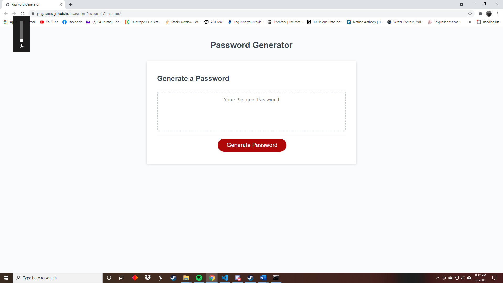

# Javascript Password Generator

### This is the repository for a password generator I developed to demenstrate my understanding of Javascript. Considering that the amount of websites that rely on accounts and therefore, login passwords are endless and that these sites often have a set of criteria for acceptable passwords,it would be useful for users to have an application that can produce a password for them based on their own choices. Having a password that is randomly generated also makes it nearly impossible for someone to guess.

## Technologies
### HTM5, CSS3, Javascript

## Setup
### Can be run in a web browser from here: https://pegasoos.github.io/Javascript-Password-Generator/
